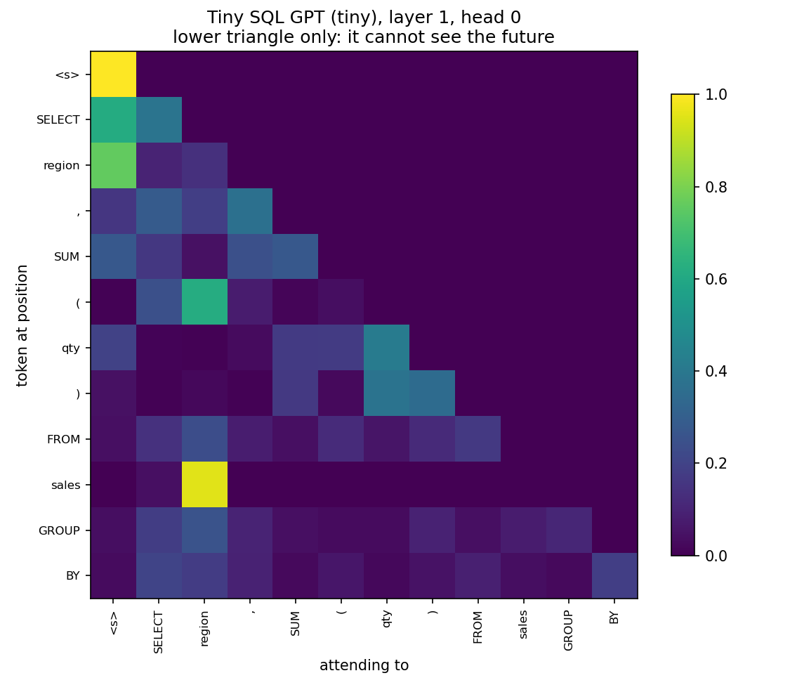

# Tiny SQL GPT

**A 841,216-parameter transformer, built from random weights, trained on a laptop CPU in 5 minutes.
100% of the SQL it generates actually executes.**

No pretrained weights. No HuggingFace model classes. No API keys. ~700 lines of Python you can read
in one sitting.

> **New to what's inside a language model?** Start with **[EXPLAIN.md](EXPLAIN.md)** — the same
> project with no maths and no jargon, in five minutes. This page is the detailed version.

```
$ python tiny_gpt.py --generate 3
SELECT segment , COUNT ( * ) FROM sales GROUP BY segment ;
SELECT plan , MIN ( age ) FROM customers WHERE tier = 'platinum' GROUP BY plan ;
SELECT status , SUM ( total ) FROM orders WHERE status = 'backorder' GROUP BY status ;
```

---

## Results

Every number below is produced by `python evaluate.py --eval`, which generates 500 queries and
runs them against a real SQLite database. Nothing is graded by eye, and the run is seeded — you
will get these exact numbers.

| metric | TinyGPT (841K params) | bigram baseline |
|---|---:|---:|
| parses | **100.0%** | 4.4% |
| **executes** | **100.0%** | 4.4% |
| `GROUP BY` agrees with `SELECT` | **100.0%** | 3.4% |
| novel (not in training set) | 13.4% | 98.6% |
| validation loss | 0.663 | — |

The bigram baseline is there on purpose. A number without a baseline is decoration.

100% is a real measurement, not a rounding flourish — but read it against the task. The grammar has
14 query shapes over a 3-table schema and a 155-token vocabulary. A model that saturates *this* is
not a text-to-SQL system; it's proof that the training loop works. The interesting number is the
13.4% novelty, and the failure in the next section.

---

## Where the model actually is

Fair question, and the one this repo gets asked most. **The model is one file: `tiny_gpt.py`.**
Every other Python file in the repo is scaffolding around it — none of them contain a model.

| file | contains the model? | what it's for |
|---|---|---|
| **`tiny_gpt.py`** | **yes — all of it** | schema, data generation, tokenizer, model, training loop, sampling, `--explain` |
| `evaluate.py` | no | runs generated SQL against SQLite, scaling curve, attention probe |
| `inference.py` | no | loads a checkpoint and generates. Imports the model from `tiny_gpt.py` |
| `test_tiny_gpt.py` | no | 11 tests |
| `push_to_hub.py` | no | packages and uploads to Hugging Face |

Inside `tiny_gpt.py`, the model itself is §4 — roughly 120 lines covering `CausalSelfAttention`,
`Block`, and `TinyGPT`. Everything imported is `torch`, `torch.nn`, and the standard library.
There is no `transformers`, no `AutoModel`, no pretrained anything.

### How it was actually trained

Exactly these commands, in this order, on a MacBook CPU — no GPU, no cloud:

```bash
python tiny_gpt.py --data                        # 100,000 queries      ~2 sec
python tiny_gpt.py --train --size tiny --steps 3000   # 841,216 params  ~5 min
python evaluate.py --eval                        # 500 queries vs SQLite  ~1 min
python evaluate.py --attention                   # probe all 16 heads    instant
python evaluate.py --scaling --steps 3000        # all four sizes       ~40 min
```

Training is `torch.optim.AdamW` over random 64-token windows of the corpus, cross-entropy on the
next token, 3,000 steps at batch 64. Loss went `4.62 → 0.66`. That is the entire training story —
the loop is ~25 lines in §6 and you can read all of it.

---

## Three things this repo does that a tutorial doesn't

### 1. An executable metric

Generated SQL is run against a real database. It works or it doesn't — no human judgement, no
vibes. This is the difference between "look, it makes plausible text" and a measurement.

### 2. A scaling curve — and it does not say what you'd expect

The same architecture at four sizes, same data, same code, all trained on one laptop.

| model | params | val loss | executes | **`GROUP BY` agrees** |
|---|---:|---:|---:|---:|
| nano | 24,736 | 0.696 | 99.6% | **41.4%** |
| micro | 124,032 | 0.670 | 99.8% | **100.0%** |
| tiny | 841,216 | 0.663 | 100.0% | 100.0% |
| small | 4,834,816 | 0.665 | 100.0% | 100.0% |


Three things fall out of this, and none of them is "bigger is better":

**Syntax is nearly free.** `nano` — 24,736 parameters, one layer — writes SQL that executes 99.6%
of the time. Surface fluency is the cheapest thing a language model learns.

**The long-range dependency is what costs parameters.** That same `nano` gets `GROUP BY` agreement
right 41.4% of the time — barely above the ~33% you'd get by picking a groupable column at random.
It learned what SQL *looks like* and almost nothing about the rule. Between 24K and 124K parameters
it goes to 100%. That is a phase transition you can watch happen on a laptop.

**Then it stops.** `small` has 200x the parameters of `nano` and is very slightly *worse* than
`tiny` on validation loss. All four models converge to ~0.66, because ~0.66 is the entropy of the
data generator — it picks tables, columns and values at random, and no model can predict a coin
flip. That floor is a property of the data, not a limitation of the models.

The useful question was never "is bigger better." It's **where does the curve bend for my task** —
because past that point, more parameters buy nothing. That's measurable in an afternoon.

#### An ablation, and a hypothesis that died

`nano` → `micro` changed depth *and* width at once, so the jump above is confounded. My hypothesis
was depth: copying a token from earlier in the sequence sounds like it needs one attention operation
to locate it and a second to move it.

So I trained `flat` — **one layer**, widened to match `micro`'s parameter count:

| model | layers | params | `GROUP BY` agrees |
|---|---:|---:|---:|
| nano | 1 | 24,736 | 41.4% |
| **flat** | **1** | **127,160** | **100.0%** |
| micro | 2 | 124,032 | 100.0% |

**Identical.** At matched parameters, depth bought nothing — the hypothesis was wrong, and the
nano→micro jump was capacity all along. Probing `flat`'s single layer finds head L0H1 at 55% on the
`SELECT` column, 6.6x uniform. One layer is enough.

In hindsight it's clear why: attending from "just after `GROUP BY`" to "just after `SELECT`" can be
done from position and syntax alone. There's no previous-token head to compose with. Copying
arbitrary *novel* bigrams is the harder job, and that's the case that needs two layers.

Reproduce with `python tiny_gpt.py --train --size flat` and `python evaluate.py --eval --size flat`.

### 3. An interpretability finding

The training data has a deliberate long-range dependency: the column after `GROUP BY` is always
the column that appeared first in `SELECT`. Learning that requires looking back ~8 tokens.

`python evaluate.py --attention` probes all 16 heads:

```
query: SELECT region , SUM ( qty ) FROM sales GROUP BY
       does any head look back at 'region' when predicting the next token?

  L1H1   0.925  █████████████████████████████████████
  L1H3   0.899  ████████████████████████████████████
  L1H0   0.534  █████████████████████
  L2H1   0.154  ██████
  ...
  L3H1   0.000

  best: layer 1, head 1 — 92.5% of its attention lands on the SELECT column
  uniform baseline would be 8.3%  (11.1x)
```

**Layer 1, head 1 learned `GROUP BY` agreement.** Not a textbook diagram — an actual head in an
actual model, found on a laptop, reproducible with one command.



---

## The honest negative

Three `(table, column)` pairs were **never** grouped during training — `orders.channel`,
`sales.product`, `customers.tier`. The columns appear everywhere else, just never after `GROUP BY`.
So: did the model learn the *rule*, or the *pairs*?

```
  [MISS] SELECT channel ... FROM orders    GROUP BY -> carrier
         p(channel)=0.0012  rank 6/155  |  control p=0.000452  ->  copy lift   2.7x
  [MISS] SELECT product ... FROM sales     GROUP BY -> segment
         p(product)=0.0009  rank 8/155  |  control p=0.000352  ->  copy lift   2.6x
  [MISS] SELECT tier    ... FROM customers GROUP BY -> plan
         p(tier)=0.0039    rank 4/155  |  control p=0.000280  ->  copy lift  13.9x

  0/3 correct on unseen pairs — mean copy lift 6.4x
```

**0 out of 3.** But look closer before calling it a failure.

*Copy lift* compares `p(col | SELECT col ... GROUP BY)` against a control prompt with a different
`SELECT` column. Naming the column in `SELECT` raises its `GROUP BY` probability by **2.6x to
13.9x** — so the copy circuit found by L1H1 *is* firing. It just loses to a blanket prior against
tokens that never appeared in that slot during training.

That is the whole story of hallucination, at 841K parameters:

> **Attention identifies the right source token. The output prior overrules it.**

The model is 100% correct on columns it has seen grouped, and confidently wrong on ones it hasn't.
It never learned a rule — it learned a very good lookup table. Scaling this up doesn't change the
mechanism; it just makes the lookup table bigger.

---

## Quickstart

```bash
pip install -r requirements.txt

python tiny_gpt.py --data              # generate 100,000 SQL queries (~2s)
python tiny_gpt.py --train             # train 841K params (~5 min, CPU)
python tiny_gpt.py --explain           # open the black box

python inference.py                    # write some SQL
python inference.py --run              # write it AND execute it against SQLite
python inference.py --probs "SELECT region , SUM ( qty ) FROM sales GROUP BY"

python evaluate.py --eval              # the headline number
python evaluate.py --attention         # probe all 16 heads
python evaluate.py --scaling           # the full curve + chart
python evaluate.py --plot              # re-render the chart from saved results

python test_tiny_gpt.py                # 11 tests, no framework
```

Trained checkpoints for `nano`, `micro`, `flat` and `tiny` are committed, so `--generate`,
`--explain`, `--eval`, `--attention` and the ablation all work without training anything.
`small` (19 MB) is not committed — `--scaling` reuses the checkpoints it finds and trains only
`small`, about 30 minutes on a laptop CPU. Everything else in `--scaling` is instant.

Sizes: `--size nano | micro | flat | tiny | small`.

---

## Open the black box

`python tiny_gpt.py --explain` prints the internals on real data — vocabulary, token IDs, the
causal mask, the **complete** probability distribution, and per-head attention.

The vocabulary is 155 tokens, which is the point: small enough to print the *entire* softmax.
No frontier model demo can do this.

```
3. CAUSAL MASK — why it cannot see the future

          <s> SELEC regio     ,   SUM     (   qty     )
    <s>     1     .     .     .     .     .     .     .
 SELECT     1     1     .     .     .     .     .     .
 region     1     1     1     .     .     .     .     .
      ,     1     1     1     1     .     .     .     .
    SUM     1     1     1     1     1     .     .     .
      (     1     1     1     1     1     1     .     .
    qty     1     1     1     1     1     1     1     .
      )     1     1     1     1     1     1     1     1

4. THE FULL DISTRIBUTION — the model outputs probabilities, not answers

Same model, same softmax, two positions. Confidence is not a property of the
model — it is a property of the context.

  context: ...SELECT region , SUM ( qty ) FROM sales GROUP BY
  CONSTRAINED — only one column can legally follow
    region        0.995  ████████████████████████████
    segment       0.002
    quarter       0.001
    (other 149)   0.001

  context: ...SELECT
  OPEN — any table column could come next
    *             0.070  ██
    COUNT         0.069  ██
    status        0.064  ██
    plan          0.064  ██
    (other 149)   0.607
```

Same model. 0.995 versus 0.070.

---

## How it works

```
 ┌─ DATA ─────────────────────────────────────────────────────────────┐
 │  A grammar we wrote (tiny_gpt.py §2) emits 100,000 SQL queries.    │
 │  Nothing scraped. Reproducible from seed 1337. 16,941 unique.      │
 │  The GROUP BY dependency is injected on purpose.                   │
 └────────────────────────────────┬───────────────────────────────────┘
                                  ▼
    "SELECT region , SUM ( qty ) FROM sales GROUP BY region ;"
                                  │  split on whitespace  →  155-token vocab
                                  ▼
              [130, 147, 99, 131, 96, 145, 97, 124, 148, 125, 121]
                                  │
                                  ▼
    tok_emb [155,128]  +  pos_emb [64,128]   ──►  x [B, T, 128]
                                  │
      ┌───────────────────────────┴────────────────────────────┐
      │  BLOCK × 4                                             │
      │    x ──► LayerNorm ──► Causal Self-Attention ──►(+)──┐ │
      │    └───────────────── residual ──────────────────────┘ │
      │    x ──► LayerNorm ──► MLP(128→512→128) ────────►(+)──┐ │
      │    └───────────────── residual ──────────────────────┘ │
      └───────────────────────────┬────────────────────────────┘
                                  ▼
                  LayerNorm ──► lm_head [128 → 155]
                                  ▼
                        logits [B, T, 155]
                                  ▼
                  cross_entropy(logits, next_token)  ──►  loss 0.661
```

Inside one attention head:

```
  x ──► Linear(128→384) ──► split ──► q, k, v   each [B, 4, T, 32]
                                        │
                    att = q @ kᵀ / √32  │  →  [B, 4, T, T]
                                        ▼
              CAUSAL MASK: position t may see 0..t, never t+1
                                        ▼
                     softmax ──► @ v ──► merge heads ──► Linear
```

---

## Layout

```
EXPLAIN.md         the no-jargon version. start here if you build with LLMs
                   but have never looked inside one.

tiny_gpt.py        §1 schema  §2 data  §3 tokenizer  §4 model
                   §5 bigram  §6 train §7 generate   §8 explain  §9 cli
inference.py       run the model. no training code, no eval harness.
evaluate.py        executable eval · scaling curve · attention probe
test_tiny_gpt.py   11 tests, plain asserts

push_to_hub.py     package + publish to the Hugging Face Hub
hf/MODEL_CARD.md   the model card template

PLAN.md            the design doc this was built from
POSTS.md           write-ups drafted from these results
data/              generated corpus + manifest (seed 1337)
checkpoints/       trained models
figures/           scaling curve, attention heatmaps
```

The core model lives in **one file** on purpose. The teaching value dies the moment a reader has to
jump across eight modules to follow one token through the network.

---

## Tests

```
$ python test_tiny_gpt.py
  ok  test_causal_mask_blocks_the_future        # change a future token, earlier logits must not move
  ok  test_checkpoint_round_trips
  ok  test_dataset_is_reproducible
  ok  test_generation_produces_parseable_output
  ok  test_groupby_rule_detector
  ok  test_heldout_pairs_never_grouped_in_training   # the held-out pairs really are held out
  ok  test_param_count_matches_hand_calc        # 841,216 against a hand-derived formula
  ok  test_shapes_match_the_diagram
  ok  test_sqlite_harness_grades_correctly
  ok  test_tokenizer_round_trips
  ok  test_training_reduces_loss

11 passed
```

---

## What this is not

- Not a text-to-SQL product. It generates SQL; it does not answer questions.
- Not a general language model. 155 tokens of vocabulary, one toy schema.
- Not a scaling-laws paper. Four points on a curve is a demonstration, not a finding.
- Not novel research. Every component here is standard. The point is that it is *legible*.

## What it is

A complete, honest, end-to-end path from a dataset you can read to a token you can explain —
with a metric, a baseline, and a negative result that wasn't cherry-picked away.

---

*Built from `PLAN.md`. Seed 1337 throughout. Everything reproducible from `python tiny_gpt.py --data`.*
